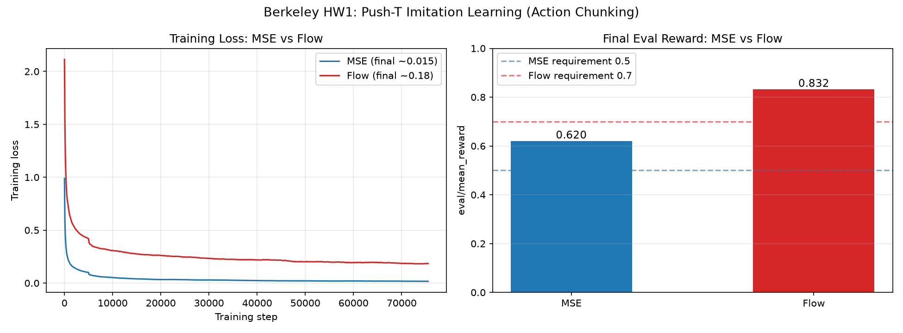

# HW1 报告：Push-T 动作分块模仿学习

## 1. 模型结构

### MSEPolicy
- 网络：MLP，结构 `state_dim(5) → 256 → 256 → 256 → action_dim*chunk_size(16)`。
- 隐藏层激活 ReLU，输出层无激活（动作为连续实数）。
- 损失：预测动作块与专家动作块的均方误差。
- 推理：一次前向输出完整动作块，开环执行 chunk_size 步。

### FlowMatchingPolicy
- 速度网络输入：`[state(5), 插值后动作块(16), 标量时间 tau(1)] = 22` 维。
- 同样的 MLP 主干，输出 16 维速度。
- 训练：$A_\tau=\tau A+(1-\tau)A_0$，监督速度 $A-A_0$。
- 推理：从高斯噪声出发，欧拉积分 $n=10$ 步，$\tau$ 从 0 到 1。

## 2. 训练曲线

- MSE 训练损失从 ~1.0 收敛到 ~0.015。
- Flow 训练损失从 ~2.1 收敛到 ~0.18（量纲与 MSE 不同，不直接比较绝对值）。

## 3. 结果

| 策略 | eval/mean_reward |
|---|---|
| MSE | 0.62 |
| Flow-Matching | 0.83 |

## 4. 分析

Flow-Matching 奖励高于 MSE。原因：同一观测可能对应多种合理的专家动作（多模态），
MSE 直接回归会把多种动作平均成一个"四不像"；Flow-Matching 从噪声生成，
能建模多模态动作分布，因此执行更准。
