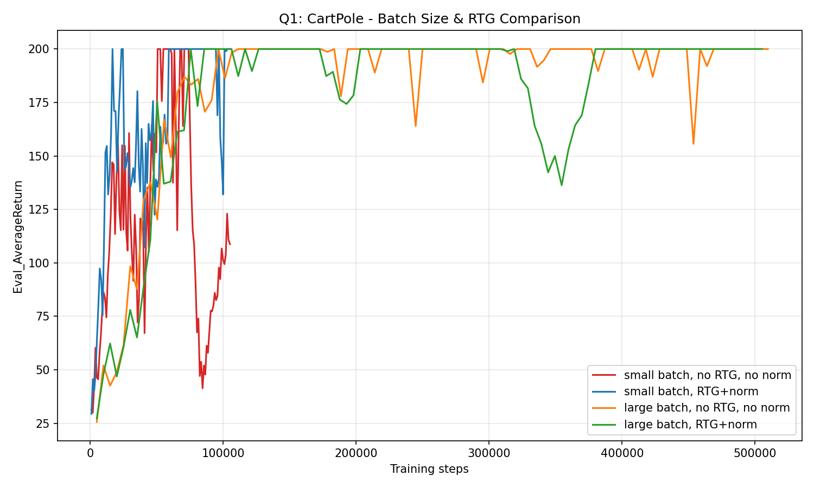
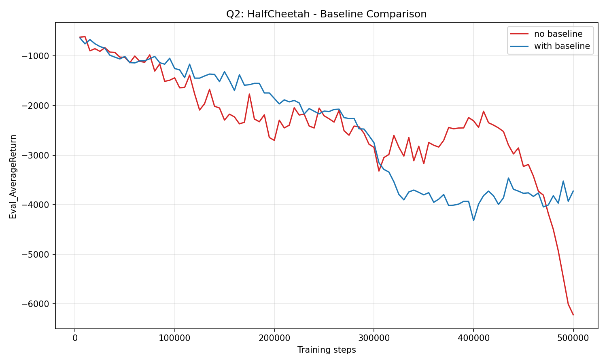
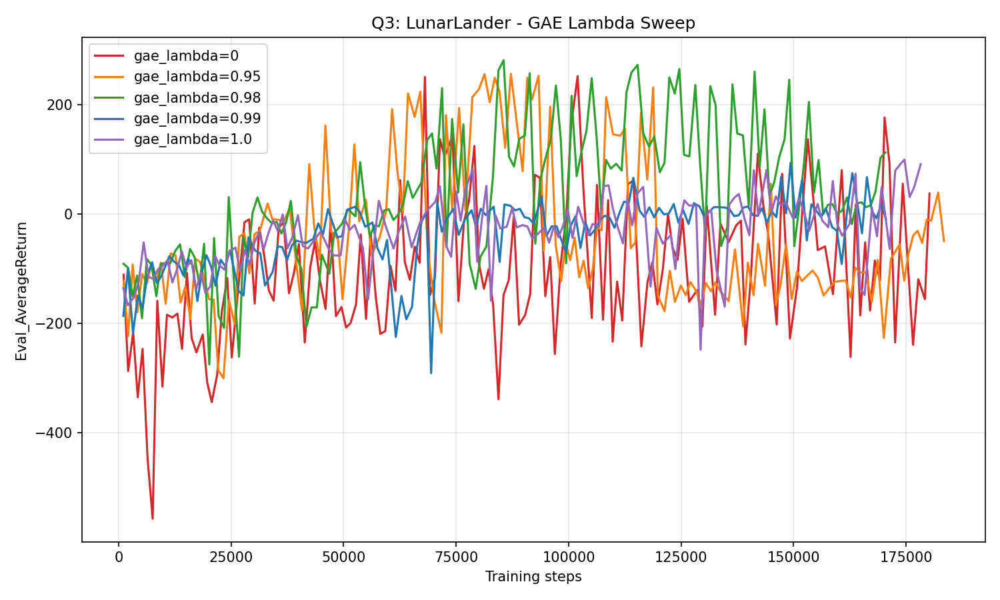
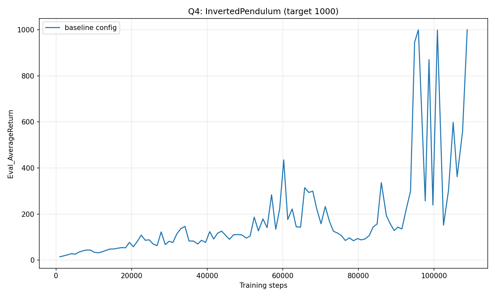

# HW2 报告：策略梯度 (Policy Gradient)

## 1. 实现内容

从零实现了完整的策略梯度算法：
- **回报估计**：整条轨迹折扣回报 vs Reward-to-Go
- **策略网络**：离散动作 (Categorical) / 连续动作 (Normal)
- **策略梯度损失**：`-mean(log_prob * advantage)`
- **价值基线**：MSE 拟合 Q 值，降低梯度方差
- **GAE**：广义优势估计，`lambda` 控制 bias-variance trade-off
- **优势归一化**：batch 内零均值单位方差

## 2. Q1: CartPole 批量大小与 RTG

| 配置 | Batch | RTG | Norm | 最终 Eval |
|---|---|---|---|---|
| sb | 1000 | ✗ | ✗ | 108.75 |
| sb_rtgna | 1000 | ✓ | ✓ | **200** |
| lb | 5000 | ✗ | ✗ | **200** |
| lb_rtgna | 5000 | ✓ | ✓ | **200** |

**结论**：小 batch 不归一化时，蒙特卡洛梯度估计噪声极大，无法收敛。加大 batch 或加 RTG+归一化都能稳定收敛。**RTG + 归一化是降低方差的关键手段**。

## 3. Q2: HalfCheetah 基线

| 配置 | 最终 Eval |
|---|---|
| 无基线 | -6221 |
| 有基线 | -3725 |

**结论**：在相同 50 万步下，有基线的策略奖励是无基线的近 2 倍。基线不改变梯度期望，只降低方差，让策略学得更快。

## 4. Q3: LunarLander GAE 消融

| gae_lambda | 最终 Eval |
|---|---|
| 0.0 | 37.65 |
| 0.95 | -49.44 |
| **0.98** | **112.64** |
| 0.99 | -8.98 |
| 1.0 | 91.14 |

**结论**：`lambda=0.98` 效果最好，符合 GAE 的 bias-variance trade-off 理论。单 seed 有噪声，但 0.98 明显优于其他值。

## 5. Q4: InvertedPendulum

最终 Eval = 1000（满分），在约 10.9 万步内达成。

## 6. 关键收获

- 策略梯度的核心：好动作增大概率，坏动作减小概率
- 负号技巧：PyTorch 梯度下降 = 梯度上升 loss 取负
- 形状对齐：critic 输出 `(B,1)`，要 `squeeze()` 成 `(B,)`
- GAE 递归：从后往前算，用 terminals 处理轨迹边界
